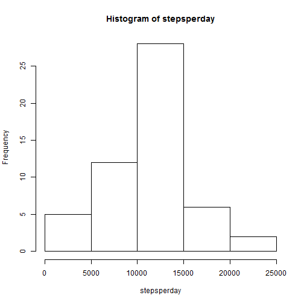
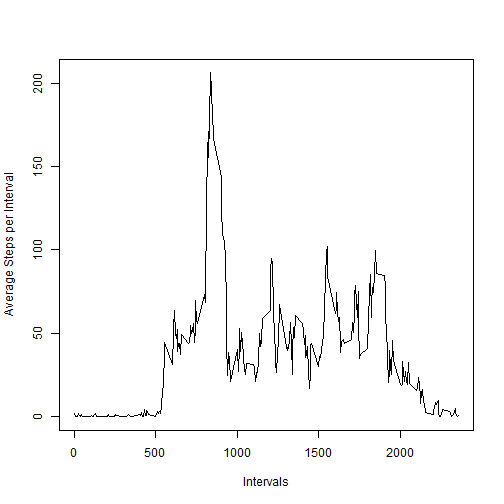
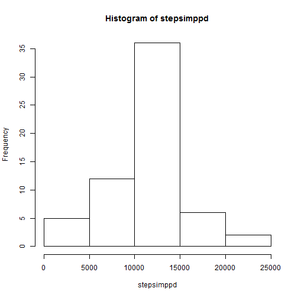
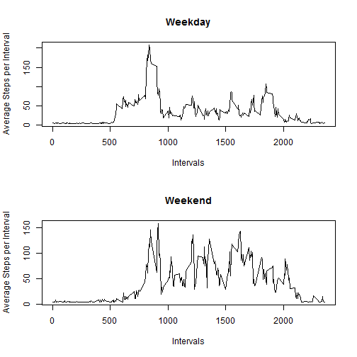

@@ -1,4 +1,9 @@
 -# Reproducible Research: Peer Assessment 1 - CW Moellenkamp
 +---
 +title: "Reproducible Research: Peer Assessment 1"
 +output: 
 +  html_document:
 +    keep_md: true
 +---
  
  
## Loading and preprocessing the data 

*Read Table and create second version removing NAs for initial processing*


```r
stepsraw<-read.csv("activity.csv")
stepscomp<-stepsraw[complete.cases(stepsraw),]
```

##Report on stepscomp table data  

*Calculate the total number of steps per day*


```r
stepspd<-tapply(stepscomp$steps,stepscomp$date,sum)
stepsperday<-stepspd[complete.cases(stepspd)]
stepsperday
```

```
## 2012-10-02 2012-10-03 2012-10-04 2012-10-05 2012-10-06 2012-10-07 
##        126      11352      12116      13294      15420      11015 
## 2012-10-09 2012-10-10 2012-10-11 2012-10-12 2012-10-13 2012-10-14 
##      12811       9900      10304      17382      12426      15098 
## 2012-10-15 2012-10-16 2012-10-17 2012-10-18 2012-10-19 2012-10-20 
##      10139      15084      13452      10056      11829      10395 
## 2012-10-21 2012-10-22 2012-10-23 2012-10-24 2012-10-25 2012-10-26 
##       8821      13460       8918       8355       2492       6778 
## 2012-10-27 2012-10-28 2012-10-29 2012-10-30 2012-10-31 2012-11-02 
##      10119      11458       5018       9819      15414      10600 
## 2012-11-03 2012-11-05 2012-11-06 2012-11-07 2012-11-08 2012-11-11 
##      10571      10439       8334      12883       3219      12608 
## 2012-11-12 2012-11-13 2012-11-15 2012-11-16 2012-11-17 2012-11-18 
##      10765       7336         41       5441      14339      15110 
## 2012-11-19 2012-11-20 2012-11-21 2012-11-22 2012-11-23 2012-11-24 
##       8841       4472      12787      20427      21194      14478 
## 2012-11-25 2012-11-26 2012-11-27 2012-11-28 2012-11-29 
##      11834      11162      13646      10183       7047
```

*Make a histogram of the number of steps per day*


```r
hist(stepsperday)
```

 

*Report the mean and median of the steps per day*


```r
meansteps<-mean(stepsperday)
mediansteps<-median(stepsperday)
meansteps
```

```
## [1] 10766.19
```

```r
mediansteps
```

```
## [1] 10765
```

*Create time series plot of the 5 minute interval average steps*


```r
avintsteps<-tapply(stepscomp$steps,stepscomp$interval,mean)
Intervals<-names(avintsteps)
plot(Intervals,avintsteps,type="l",ylab="Average Steps per Interval")
```

 

*Report which interval on average has the maximum steps*


```r
maxstepinterval<-names(avintsteps[max(avintsteps)])
maxstepinterval
```

```
## [1] "1705"
```

##Impute Missing Values in the original data file called stepsraw

*Report the total number of missing values in the dataset*


```r
NAvals<-sum(is.na(stepsraw$steps))
NAvals
```

```
## [1] 2304
```

*Develop strategy to replace NAs*  
**Use overall daily mean divided by 288 intervals per day to fill in missing data**


```r
meaninterval<-meansteps/288
stepsimpute<-stepsraw
stepsimpute$steps[which(is.na(stepsimpute$steps))]<-meaninterval
```

*Create histogram of this new dataset stepsimpute on a steps per day basis*


```r
stepsimppd<-tapply(stepsimpute$steps,stepsimpute$date,sum)
hist(stepsimppd)
```

 

*Report mean and median of the imputed data set*


```r
meanstepsimp<-mean(stepsimppd)
medianstepsimp<-median(stepsimppd)
meanstepsimp
```

```
## [1] 10766.19
```

```r
medianstepsimp
```

```
## [1] 10766.19
```

**These data differ by adding steps at a mean value across all intervals - the** **mean is slightly higher and median is the same as in the data with NAs removed since more steps were added when the mean per interval values were added**


**The impact of imputing missing data is pushing more steps into the center**
**of the histogram in the grouping containing the mean of 10,766 steps per day**

##Now lets add a factor noting if a date is a weekend or weekday  

*This will allow us to see when more steps are taken on average*


```r
library(dplyr)
```

```
## 
## Attaching package: 'dplyr'
## 
## The following objects are masked from 'package:stats':
## 
##     filter, lag
## 
## The following objects are masked from 'package:base':
## 
##     intersect, setdiff, setequal, union
```

```r
wday<-c("Monday","Tuesday","Wednesday","Thursday","Friday")
stepsimpute<-mutate(stepsimpute,dayfactor=
                      factor(weekdays(as.Date(stepsimpute$date)) %in% wday,
                      levels=c(TRUE,FALSE),labels=c("DAY","END")))
```

*Create a plot of averages of weekdays in one panel and*
*weekends in another panel*


```r
stepsimputeend<-stepsimpute[stepsimpute$dayfactor=="END",]
stepsimputewday<-stepsimpute[stepsimpute$dayfactor=="DAY",]

endimpavstep<-tapply(stepsimputeend$steps,stepsimputeend$interval,mean)
Intervalsend<-names(endimpavstep)

dayimpavstep<-tapply(stepsimputewday$steps,stepsimputewday$interval,mean)
Intervalsday<-names(dayimpavstep)

par(mfrow=c(2,1))

plot(Intervalsday,dayimpavstep,type="l",ylab="Average Steps per Interval",
     xlab="Intervals", main ="Weekday")

plot(Intervalsend,endimpavstep,type="l",ylab="Average Steps per Interval",
     xlab="Intervals", main="Weekend")
```

 
